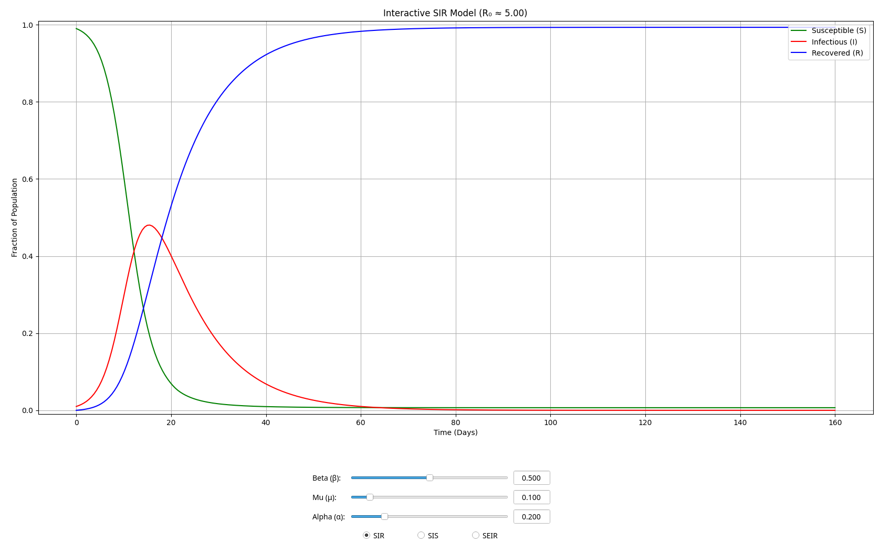

<div align="justify">

# Interactive Epidemic Modeler

This repository contains the source code for an interactive GUI application
that simulates and visualizes common epidemic models. The project allows users
to adjust model parameters in real-time and observe their effect on the spread
of a disease using the **SIR**, **SIS**, and **SEIR** models.

## 🚀 Setup

1.  **Clone the repository**

    ```bash
    git clone https://github.com/RahulSandhu/epidemic-sim
    cd epidemic-sim
    ```

2.  **Create and activate a virtual environment**

    ```bash
    python3 -m venv .venv
    source .venv/bin/activate
    ```

3.  **Install dependencies**

    This project uses a `pyproject.toml` file. You can install the project and
    all its dependencies with:

    ```bash
    pip install .
    ```

## 💻 Source

- `src/main.py`: The main application script. Contains all logic for the GUI,
  model solving, and plotting.

## ✨ Features

- **Model Simulation:** Interactively simulates the **SIR**, **SIS**, and
  **SEIR** epidemiological models.
- **Real-time Controls:** Adjust model parameters (Beta, Mu, Alpha) using
  sliders and text inputs.
- **Interactive Visualization:** The Matplotlib plot updates instantly to
  reflect parameter changes.
- **Model Switching:** Easily switch between models using radio buttons.
- **Data Tooltips:** Hover over the plotlines to see the exact values for a
  given day.

<div align="center">
  
</div>

</div>
